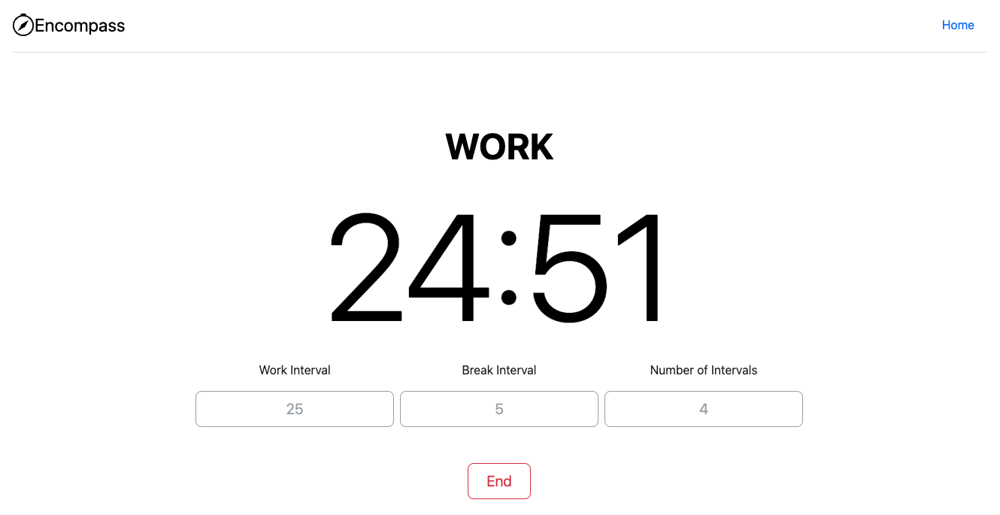
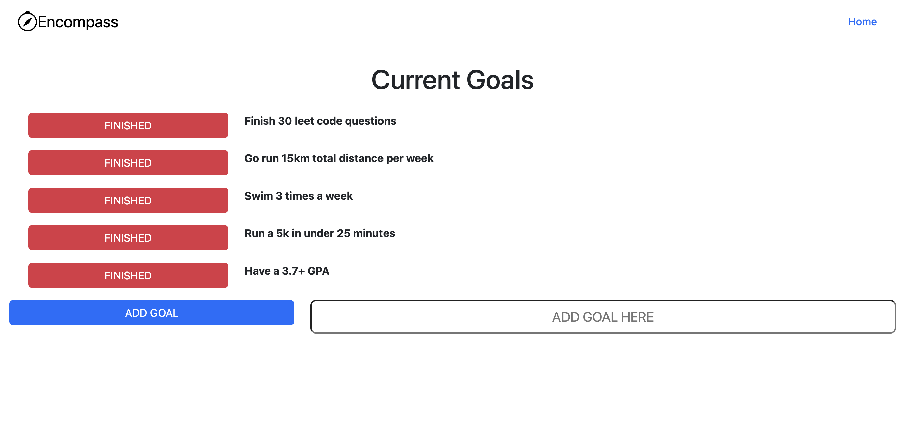
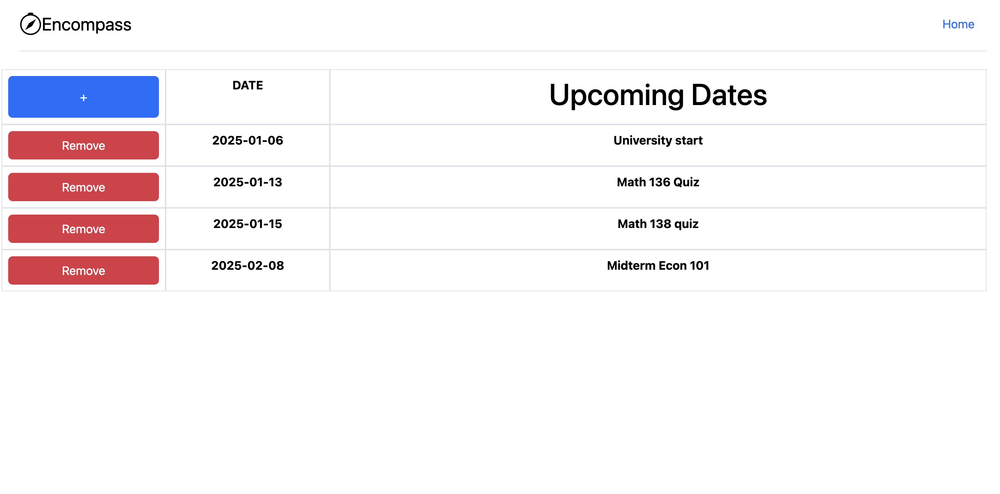
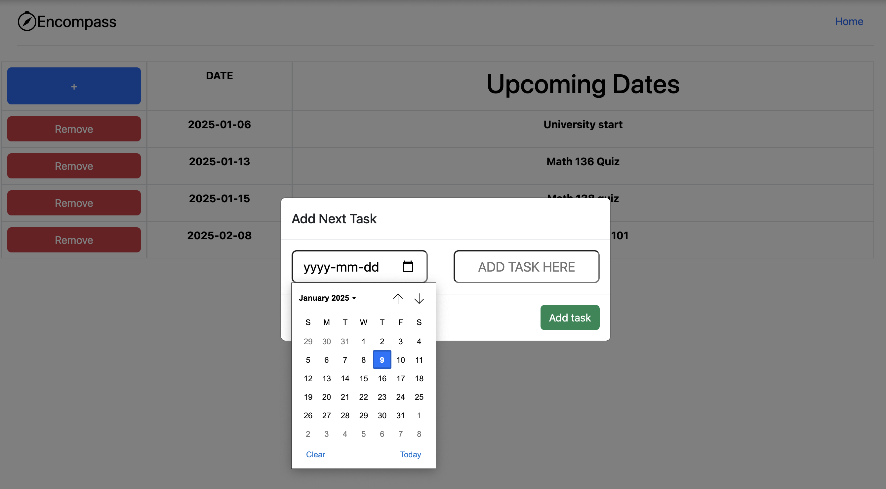

# Encompass
## Table of Content
### - [Features](#features)
### - [Installation](#Installation)
### - [Demo](#Demo)
### - [Usage](#Usage)

## Features
### Pomodoro Timer 
- Pomodoro Timer used to set up structured time intervals to increase productivity 
- To use the Pomodoro Timer input the time interval (in minutes) then click start
- The timer will automatically swap between work and break intervals

### Flashcard
- Flashcards used to improve memorization of chosen topics
- Simply, create a set of flashcards, select it from the library and press on the card to swap between sides

### Goal Tracker
- Goal Tracker to keep accountability and track current goals

### Calendar 
- Calendar to keep track of upcoming tasks and events

## Installation
- Feel free to install Encompass. Welcome  to any testing, adjustments or updates to the project. 
- Steps:
  - Clone repository 
  - Create a MongoDB and replace unique keys and information with your own
  - Run application
    
## Demo
- To view a demo of Encompass: https://youtu.be/FbfhiUuBTio

## Usage
- Created to inspire and promote productivity. An application with multiple tools to remove the hassle of swapping between services. An app created for all ages looking for a central app to boost productivity
